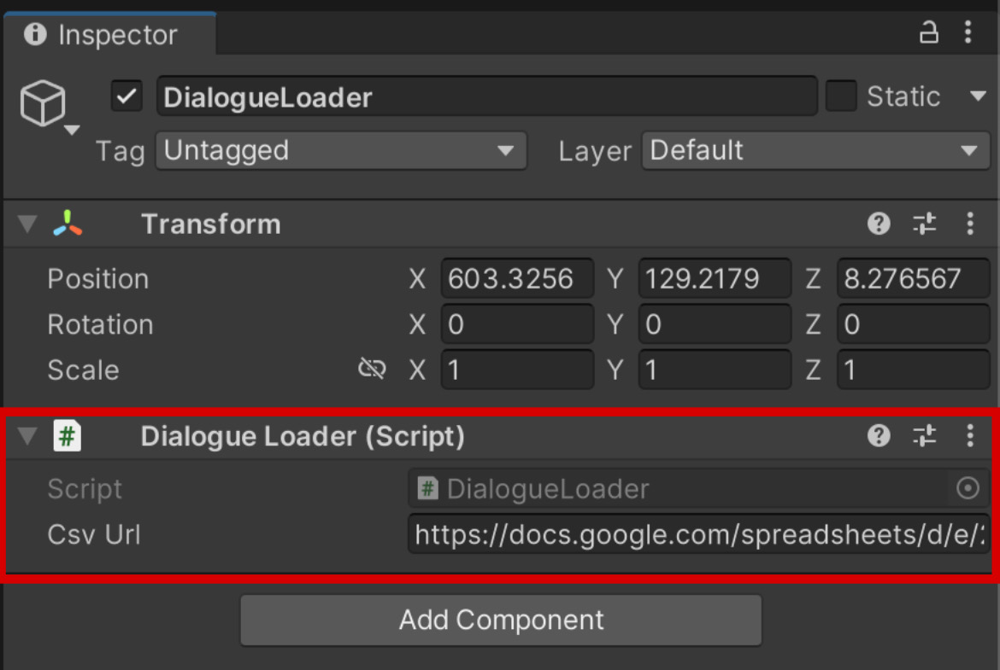
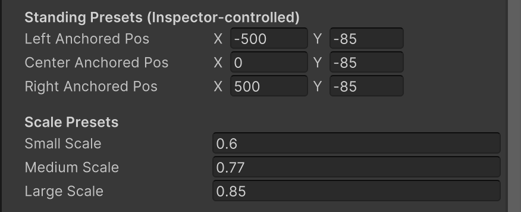
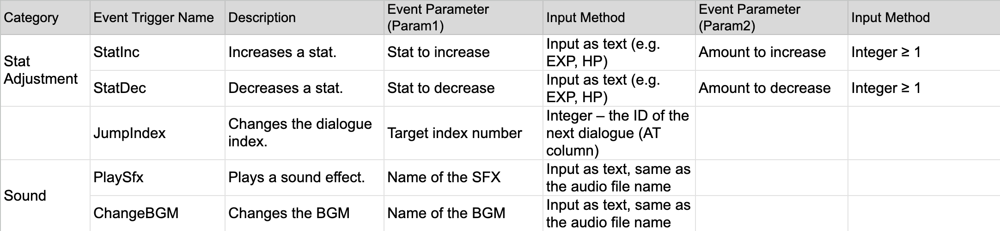

# Iyagi_VN_Toolkit

> Create your own **visual novel** with **Google Sheets**.
> *Iyagi (이야기, meaning story in Korean)* is a lightweight Unity toolkit for building narrative experiences through data-driven design.

## Overview

**Iyagi_VN_Toolkit** is a Unity toolkit designed for fast and flexible **visual novel prototyping** using Google Spreadsheets.
It allows you to write dialogue, choices, background changes, and simple events directly in Google Sheets — then automatically parses and displays them in Unity.

This system is easily extendable, making it ideal for both beginners and advanced users who want to manage dialogue and scenario data outside of Unity.

> For questions or suggestions, please contact **[juliyooni@gmail.com](mailto:juliyooni@gmail.com)**

## 💾 Download

You can download the [**Iyagi_VN_Toolkit v0.8.0 (Beta)**](https://drive.google.com/file/d/1doJzbcvUyqkv5amNIBqWqLf6a9bxJKvr/view?usp=drive_link) as a compressed Unity project package.

⚠️ Note: After downloading, extract the folder and open it in Unity 2022.3.4f1 or newer.
Make sure to allow Unity to re-import assets on first launch (this may take a few minutes).

## Version Info

**Current Version:** v0.8.0 (Beta)

* **Implemented Features**
  - CSV-based dialogue parser  
  - Multi-language localization (KR/EN, partial UI support)  
  - BGM / SFX event triggers  
  - Choice branching system  

* **In Progress**
  - Save / Load system (basic data structure ready)  
  - Editor integration for custom events  

## ⚙️ Environment

* **Unity**: 2022.3.4f1
* **Google Sheets**: CSV publishing feature enabled

## How to Use

### Link Your Google Spreadsheet

1. **Duplicate the sample sheet**
   👉 [Open Sample Sheet](https://docs.google.com/spreadsheets/d/1XetuvK_KMFS9g_IP5TAKqfraV5TGdR3L/edit?usp=sharing&ouid=100234993368063189472&rtpof=true&sd=true)

2. **Write your story**

   * Add your own dialogue, backgrounds, and effects directly into the sheet.
   * See [How to Write Sheets](#sheet-structure) for detailed column instructions.

3. **Publish the sheet as a CSV**

   * Go to **File → Share → Publish to the web**
   * Publish only `testSheet` as `.csv` and copy the link.

4. **Paste the link in Unity**

   * In the `02_GameScene`, select **DialogueLoader** in the Hierarchy
   * Paste the CSV link into the **Csv Url** field of the `DialogueLoader` script
     

5. **Restart Unity for stability**

   * Save your project, restart Unity, and open `01_TitleScene`
   * Press **Play** to start your own story 🎬

## Sheet Structure

### 💬 Basic Columns

| Column         | Required | Example  | Description                                        |
| -------------- | -------- | -------- | -------------------------------------------------- |
| Scene          | ✅        | 1        | Narrative scene number (not Unity scene)           |
| Index          | ✅        | 32       | Line index within the scene                        |
| ID             | Auto     | 1032     | Auto-generated Scene + Index combo (used by Unity) |
| Speaker        | ✅        | Narrator | Character name to show(optional)                          |
| Line_ENG       | ✅        | Hello!   | Dialogue text                                      |
| ParsedLine_ENG | Auto     | “Hello!” | Processed text actually used by Unity         |
| SFX            | ❌        | click_01 | Sound effect played with the line                  |
| BG             | ✅        | council  | Background image name (in `Resources/Image/BG`)    |
| Auto           | ✅        | FALSE    | Skip player input and auto-continue dialogue       |

### 🔀 Choices

| Column     | Required | Example           | Description                             |
| ---------- | -------- | ----------------- | --------------------------------------- |
| Choice1ENG | ❌        | Ignore him.       | 1st choice text                         |
| Choice2ENG | ❌        | Greet brightly.   | 2nd choice text                         |
| Next1      | ⚠️       | 1013              | ID to jump to when choice 1 is selected |
| Next2      | ⚠️       | 1022              | ID to jump to when choice 2 is selected |
| C1_ENG     | Auto     | “Ignore him.”     | Parsed choice 1 text actually used by Unity                    |
| C2_ENG     | Auto     | “Greet brightly.” | Parsed choice 2 text actually used by Unity                   |

### 👥 Character Standing Images

| Column    | Required | Example       | Description           |
| --------- | -------- | ------------- | --------------------- |
| Char1Name | ❌        | Hans          | Character name        |
| Char1Look | ❌        | Normal_Normal | Expression or pose    |
| Char1Pos  | ❌        | Center        | On-screen position    |
| Char1Size | ❌        | Medium        | Character sprite size |

> * The system loads resources from the path:
>   `Resources/Image/Standing/{Char1Name}_{Char1Look}.png`
> * Default position and size values can be adjusted under
>   **Canvas → DialogueUI (Inspector)** in `02_GameScene`.
>   

### 🎬 Event Triggers

| Column  | Required | Example   | Description           |
| ------- | -------- | --------- | --------------------- |
| Trigger | ❌        | ChangeBGM | Event trigger keyword |
| Param1  | ❌        | D960_1    | Parameter 1           |
| Param2  | ❌        | —         | Parameter 2           |

> You can find available triggers and examples in the `eventTrigger` sheet.
> 
> Extend freely to create custom events as needed.

## 🛠️ Contribution & Support

* Feel free to open an **Issue** or **Pull Request**.
* Contact: **[juliyooni@gmail.com](mailto:juliyooni@gmail.com)**
* When reporting bugs, please attach screenshots and clear steps to reproduce.

## License

> **MIT License**
> Free to modify and use for personal or commercial projects.
> Attribution is appreciated but not required.

## 🎧 Audio Credits
Sound effects obtained from Freesound.org under the Creative Commons Attribution (CC BY 4.0) License.  
- Gavel by Science_Witch -- https://freesound.org/s/762733/ -- License: Attribution 4.0
- Berland River 210818-T010.wav by Robert.Crosley -- https://freesound.org/s/634810/ -- License: Attribution 4.0

